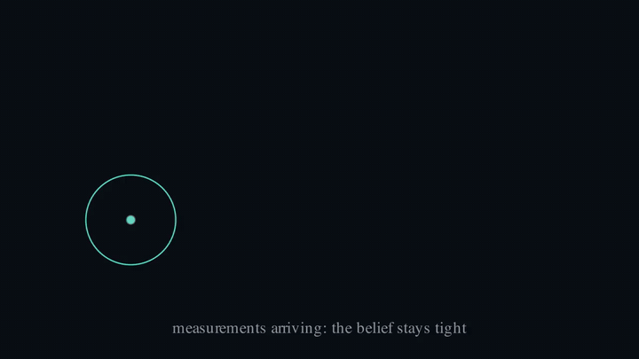

# nano-kalman

A Kalman filter from scratch, tracking a noisy ball in the browser. The filter is 50 lines of vanilla JavaScript, and it makes one argument: agents act on beliefs, not observations.


## Run it

Live sandbox: **https://roybenjamin.com/nano-kalman/**

Or run it from a clone. There is no build step, no server, and no dependency:

```sh
git clone https://github.com/RoyBenjamin/nano-kalman.git
open nano-kalman/index.html
```

On the canvas: the faint circle is the true ball, the grey squares are noisy position measurements, and the teal track is the filter's belief, wearing its 95% uncertainty ellipse. Two sliders control everything that matters: "σ_obs · trust the sensor" and "σ_a · trust the model". Four presets each teach one thing: "noisy sensor", "occlusion", "overconfident model", "kidnap". The readout in the corner shows the innovation, the distance between what the sensor said and what the filter expected.

A thirty-second tour:

1. Press "noisy sensor". The dots are a storm; the teal line is calm. That calm is the whole product.
2. Press "occlusion" and watch the ellipse balloon inside the strip, then snap tight on the far side. Drag the strip around; the filter does not care where the dark is.
3. Slide σ_obs to both ends and feel the gain move: sharp sensor, the belief clings to the dots; noisy sensor, it clings to the model.
4. Press "kidnap" and watch the innovation readout spike, then decay as the filter concedes to the evidence.

## The five equations

State is position and velocity in 2D, `x = [px, py, vx, vy]`. The whole filter is:

```
Predict:   x̂⁻ = F x̂                 P⁻ = F P Fᵀ + Q
Update:    K  = P⁻ Hᵀ (H P⁻ Hᵀ + R)⁻¹
           x̂  = x̂⁻ + K (z − H x̂⁻)
           P  = (I − K H) P⁻
```

The rest of this README derives them from one idea, then shows where they break.

### Beliefs stay Gaussian under linear maps

The filter never stores a position. It stores a belief about position: a Gaussian with mean `x̂` and covariance `P`. This representation survives everything the model does to it, because a linear function of a Gaussian is Gaussian, and the product of two Gaussians is Gaussian. Push `N(x̂, P)` through a linear map `F` and you get exactly `N(F x̂, F P Fᵀ)`. No approximation, no sampling. That closure property is the entire reason the Kalman filter has a closed form.

Our dynamics are constant velocity: each frame, position moves by `velocity · dt`. The measurement is position only, corrupted by Gaussian noise with standard deviation σ_obs:

```
F = | 1 0 dt 0 |        H = | 1 0 0 0 |        R = σ_obs² · I₂
    | 0 1 0 dt |            | 0 1 0 0 |
    | 0 0 1  0 |
    | 0 0 0  1 |
```

### Predict: push the belief through the dynamics

Prediction is just that push: `x̂⁻ = F x̂` moves the mean the way the physics would move a point, and `P⁻ = F P Fᵀ + Q` moves the uncertainty the same way, then adds `Q`, the process noise. `Q` is the filter's confession that its model is not the world. We use the standard white-noise-acceleration form per axis:

```
Q_axis = σ_a² · | dt⁴/4  dt³/2 |
                | dt³/2  dt²   |
```

Every predict step makes the belief a little wider. Only evidence shrinks it. When measurements stop, prediction is all you have, and `P` grows without bound. That is not a bug; it is honesty.



### Update, derived in one dimension first

Strip the problem to scalars. You believe the ball is at μ_prior with variance σ_prior². The sensor says z, with variance σ_obs². Multiply the two Gaussians and renormalize. Precisions (inverse variances) add, and the posterior mean is the precision-weighted average:

```
1/σ²  =  1/σ_prior²  +  1/σ_obs²
μ     =  σ² · ( μ_prior/σ_prior²  +  z/σ_obs² )
```

Rearrange the mean into an error-correction form and a single number falls out:

```
μ = μ_prior + K · (z − μ_prior)        where K = σ_prior² / (σ_prior² + σ_obs²)
σ² = (1 − K) · σ_prior²
```

K is the Kalman gain, and it is nothing more than a trust ratio. Sharp sensor (σ_obs → 0): K → 1, believe the measurement. Vague sensor (σ_obs → ∞): K → 0, keep the model. Every value in between is a precision-weighted argument, which is what the GainBlend animation above is showing.

The matrix case is the same statement with bookkeeping. σ_prior² becomes `P⁻`, σ_obs² becomes `R`, and `H` translates between state space and measurement space:

```
K = P⁻ Hᵀ (H P⁻ Hᵀ + R)⁻¹
```

Read it inside out: `H P⁻ Hᵀ + R` is the total variance you expect on the sensor (belief pushed into measurement space, plus sensor noise). Dividing the prior covariance by it is the same trust ratio as before. In this repo `H P⁻ Hᵀ + R` is 2×2, so "dividing" is a hand-coded adjugate-over-determinant inverse, and no linear algebra library ever gets imported. The innovation `ν = z − H x̂⁻` is the surprise; `K ν` is how much of the surprise the filter accepts.

### The ellipse is the belief made visible

The demo never draws `P` as numbers. It draws the position block of `P` as an ellipse: eigenvalues from the closed form `(a+c)/2 ± sqrt(((a−c)/2)² + b²)`, angle `0.5·atan2(2b, a−c)`, radii `2√λ` for roughly 95% coverage. Watch the "occlusion" preset: the ball enters the strip, measurements stop, updates stop, and the ellipse balloons frame by frame while the estimate glides on dead reckoning. First measurement on the far side, and it snaps tight. Belief maintained without evidence, honestly uncertain.

### Q is humility

The "overconfident model" preset sets σ_a near zero and lets the ball bounce off a wall. The constant-velocity model does not know about walls, and with `Q ≈ 0` the filter has declared its model perfect, so the gain has decayed toward zero and evidence barely registers. The estimate sails through the wall like a ghost and takes a long, visible string of measurements to concede. Model mismatch shown honestly is worth more than a filter that never fails: `Q` is humility, the knob that admits the model is wrong enough to keep listening.

### The bridge, and the cliffhanger

Notice what the filter actually does. It maintains state in a representation space (mean and covariance), advances it with a model, corrects it with observations, and only decodes to screen coordinates for display. That loop, predict in latent space, correct on evidence, decode for output, is exactly the skeleton of a learned world model. The Kalman filter is the closed-form ancestor: the case where the representation is forced to be Gaussian and the dynamics are forced to be linear, so learning is unnecessary.

The price of the closed form is unimodality. A Gaussian has one peak, so this filter cannot represent "the ball went left or right around the pillar". It will average the two futures and believe in the physically impossible middle. That fork is where Gaussians die, and it is the cliffhanger the next two repos in this series resolve, first with representations that are learned, then with beliefs that are imagined forward.

## Results

The standard consistency oracle for a Kalman filter is the normalized innovation squared, `NIS = νᵀ S⁻¹ ν` with `S = H P⁻ Hᵀ + R`. If the filter's covariance is honest, its average equals the measurement dimension, 2. Measured over 1950 matched-noise steps: **mean NIS 2.072**. Regenerate from the repo root:

```sh
node -e "$(cat world.js kalman.js)
world.reset(42); world.x=[W/2,HGT/2,0,0]; world.sigA=15; world.sigObs=12;
const kf=kfInit(...world.measure()); let s=0,n=0;
for(let i=0;i<2000;i++){world.step(DT);kfPredict(kf,DT,15);
  const{nis}=kfUpdate(kf,world.measure(),12);if(i>=50){s+=nis;n++}}
console.log('mean NIS', (s/n).toFixed(3), 'over', n, 'steps (theory: 2)');"
```

One measured line per preset, same session, same seeds as the shipped code:

- "noisy sensor": at σ_obs 35 the estimate glides smoothly through a storm of scattered dots; the filter is a principled average over time.
- "occlusion": the position-covariance trace grew from 11.3 to 73.9 across 205 dark frames, then snapped back after reacquisition.
- "overconfident model": after the wall bounce the estimate peaked 269 px away from the truth, the ghost this preset exists to show.
- "kidnap": the innovation readout spiked to 220 px on teleport and the estimate was back within 15 px of the truth in 55 frames.

The two figures regenerate with (LaTeX not required, the scenes use plain text; the last line converts the mp4 to the committed GIF and repeats for EllipseBreathes):

```sh
uv sync --group docs
uv run --group docs manim -qm --media_dir manim/out manim/scenes.py GainBlend
uv run --group docs manim -qm --media_dir manim/out manim/scenes.py EllipseBreathes
ffmpeg -i manim/out/videos/scenes/720p30/GainBlend.mp4 -vf "fps=18,scale=720:-1:flags=lanczos,split[a][b];[a]palettegen=max_colors=96[p];[b][p]paletteuse=dither=bayer:bayer_scale=4" media/GainBlend.gif
```

## Repo map

| File | Lines | One idea |
|---|---|---|
| `kalman.js` | 50 | Predict, update, 2×2 inverse. The whole filter |
| `world.js` | 34 | True dynamics, noisy measurements, seeded RNG |
| `ui.js` | 94 | Render loop, uncertainty ellipse, presets, preset captions |
| `index.html` | 149 | Canvas, sliders, preset buttons, and the on-page explainer (62 lines of style block and the essay prose are presentation, outside the core budget) |
| `manim/scenes.py` | 98 | The two README figures; documentation tooling, outside the core budget |

Zero dependencies at runtime. Python appears only as documentation tooling, uv-managed under the `docs` group.

## What this is not

No extended Kalman filter, no unscented anything, no particle filter, no learned components. The linear-Gaussian case is the whole point: it is the one you can hold in your head, and the one whose failure modes (the wall, the fork) motivate everything that came after. The fenced extensions live as `stretch` issues on this repo, and the particle-filter comparison this demo is secretly setting up lives in the Latent Playground, part 2 of the series.

## License

MIT. Fonts are Space Grotesk and JetBrains Mono, self-hosted under the OFL (licenses in `assets/fonts/`). Part 1 of the [nano world-models series](https://github.com/RoyBenjamin).
